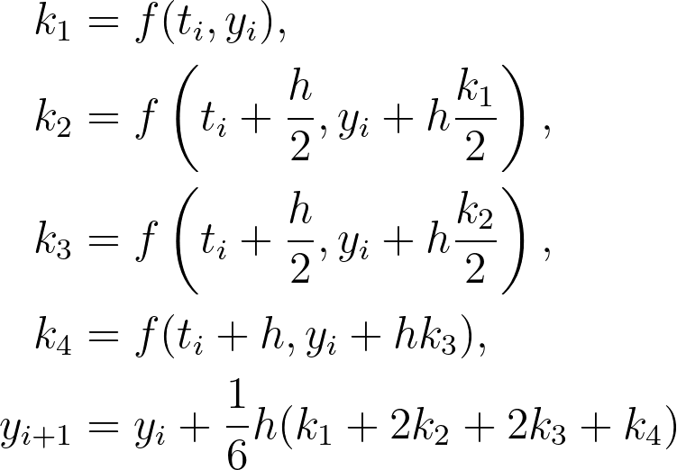
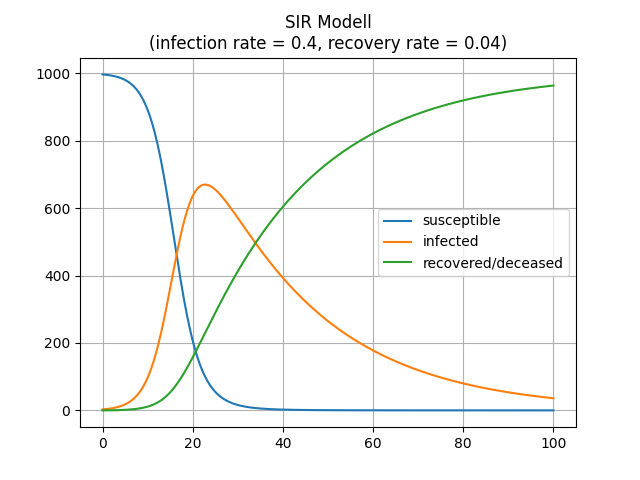
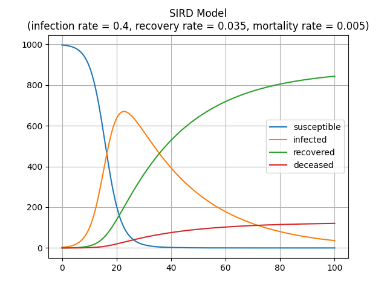

# SIR Model
The SIR model describes the change of the amount of susceptible, infected and recovered people while a disease is spreading around. Behind this model is a system of ordinary differential equations with parameters ```p1```, ```p2``` that note the infection and recovery rate. ```N``` is the sum of all people or ```S+I+R```.


# SIRD Model
This model is an extension of the SIR model and distinguishes between recovered an deceased people, whereas before ```R``` meant recovered or deceased. The second equation gets extended and another ordinary differential equation is added to the system with the parameter ```p3``` being the mortality rate. Now ```N``` is the sum of ```S```, ```I```, ```R``` and ```D```.


# Runge-Kutta Method
To solve an ordinary differential equation as an initial value problem, oftentimes numerical methods are used to approximate solutions. The Runge Kutta methods are actually a whole family of numerical methods but I implemented the classic Runge-Kutta method of order 4.



# Approximate Solutions
Here is an example for each model with ```3 infected``` and ```997 susceptible``` people in ```t=0```.




